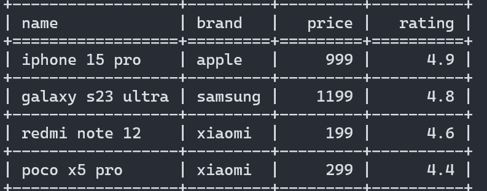
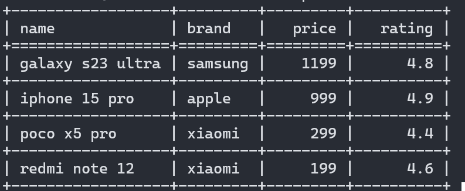
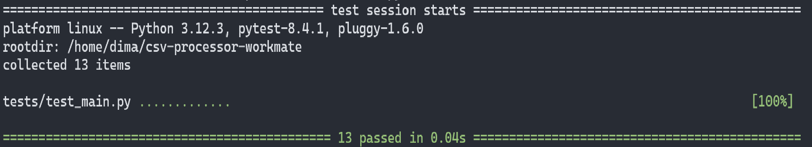
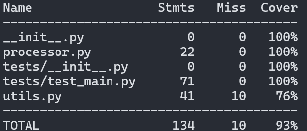

# CSV Процессор
Python инструмент для обработки CSV файлов.
Поддерживает фильтрацию, агрегацию и сортировку.

## Использование
### Пример CSV файла products.csv:
name,brand,price,rating
iphone 15 pro,apple,999,4.9
galaxy s23 ultra,samsung,1199,4.8
redmi note 12,xiaomi,199,4.6
poco x5 pro,xiaomi,299,4.4

### 📄 Отобразить все данные
```bash
python main.py --file products.csv
```


### 🔎 Фильтровать по рядам
```bash
python main.py --file products.csv --where "rating>4.5"
```


### 📊 Агрегировать цифровые значения
```bash
python main.py --file products.csv --aggregate "price=avg"
python main.py --file products.csv --aggregate "rating=max"
```

### ↕️ Сортировать по рядам
```bash
python main.py --file products.csv --order-by "price=desc"
python main.py --file products.csv --order-by "name=asc"
```


### 🧠 Комбинированный запрос
```bash
python main.py --file products.csv \
  --where "brand=xiaomi" \
  --order-by "price=asc" \
  --aggregate "price=max"
```

---

## 🧪 Тестирование
```bash
pytest
```



```bash
coverage run -m pytest
coverage report
```


